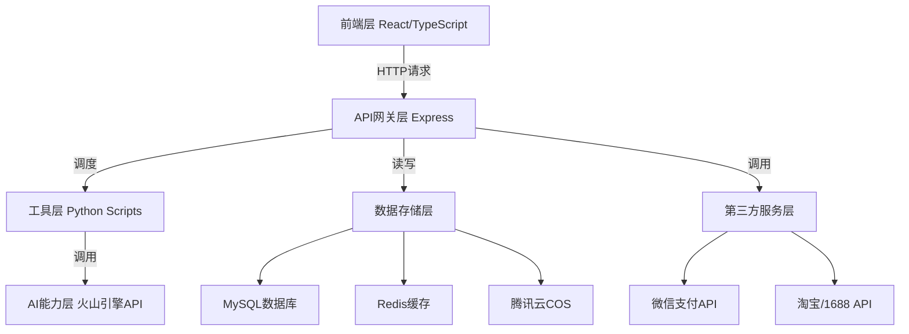

# Design Document

## Overview

AI全家福·团圆照相馆是一个基于火山引擎AI的艺术照生成平台。本设计文档描述了系统的技术架构、核心组件、数据模型和实现策略,目标是在2026年1月20日前完成MVP上线。

系统采用"Node.js调度 + Python工具层"的混合架构,前端使用React + TypeScript,后端使用Express,数据库使用MySQL,对象存储使用腾讯云COS。核心功能包括4选1生成策略、支付系统、水印功能、微动态生成等。

## Architecture

### System Architecture

系统采用分层架构,包含以下层级:

1. **前端层**: React + TypeScript + Vite,负责用户交互和UI展示
2. **API网关层**: Express服务器,负责请求路由和业务逻辑调度
3. **工具层**: Python脚本,负责图片预处理和AI API调用
4. **AI能力层**: 火山引擎API,提供艺术照生成和微动态生成能力
5. **数据存储层**: MySQL数据库 + Redis缓存 + 腾讯云COS对象存储
6. **第三方服务层**: 微信支付API + 淘宝/1688一件代发API

### Architecture Diagram



### Communication Flow

1. 用户在前端上传照片并选择模板
2. 前端调用后端API上传图片到OSS
3. 后端调用Python脚本进行图片预处理(压缩、人脸检测)
4. 后端调用火山引擎API生成4张艺术照(不同seed值)
5. 后端轮询火山引擎API获取生成结果
6. 生成完成后,后端将结果图片上传到OSS
7. 后端返回4张图片URL给前端,前端以4宫格展示
8. 用户选择满意的照片,点击保存触发支付流程
9. 支付成功后,后端生成无水印高清图并返回下载链接

## Components and Interfaces

### Frontend Components

#### 1. LandingPage Component
- **职责**: 展示产品介绍和引导用户进入创作页面
- **状态**: 无状态组件
- **接口**: 导航到GeneratorPage

#### 2. GeneratorPage Component
- **职责**: 核心生成页面,处理图片上传、模板选择、生成和支付流程
- **状态**:
  - `selectedImages: string[]` - 用户上传的照片列表
  - `selectedTemplate: string` - 选中的模板URL
  - `generatedImages: string[]` - 生成的4张艺术照URL
  - `selectedResult: string` - 用户选中的结果照片URL
  - `isGenerating: boolean` - 是否正在生成
  - `isPaid: boolean` - 是否已付费
- **接口**:
  - `handleUpload(files: File[]): void` - 处理图片上传
  - `handleTemplateSelect(templateUrl: string): void` - 选择模板
  - `handleGenerate(): Promise<void>` - 触发生成
  - `handleSelectResult(imageUrl: string): void` - 选择结果
  - `handlePay(): Promise<void>` - 触发支付

#### 3. FourGridSelector Component (新增)
- **职责**: 以4宫格形式展示生成的4张艺术照,支持用户选择
- **Props**:
  - `images: string[]` - 4张图片URL
  - `selectedImage: string | null` - 当前选中的图片
  - `onSelect: (imageUrl: string) => void` - 选择回调
- **接口**: 点击图片触发选择

#### 4. PaymentModal Component
- **职责**: 展示支付选项和处理支付流程
- **Props**:
  - `isOpen: boolean` - 是否显示
  - `onClose: () => void` - 关闭回调
  - `onComplete: () => void` - 支付完成回调
- **接口**:
  - 展示三种套餐(免费/9.9元/29.9元)
  - 调用微信支付API
  - 处理支付结果

#### 5. WatermarkOverlay Component (新增)
- **职责**: 在免费版照片上添加水印
- **Props**:
  - `imageUrl: string` - 原始图片URL
  - `watermarkText: string` - 水印文字
- **接口**: 返回带水印的图片URL

#### 6. CanvasPositioning Component (新增)
- **职责**: 提供画布界面,允许用户拖拽定位人脸位置
- **Props**:
  - `backgroundUrl: string` - 背景模板URL
  - `faceImages: Array<{url: string, faceData: object}>` - 提取的人脸图片列表
  - `onComplete: (positions: Array<{x: number, y: number, scale: number, rotation: number}>) => void` - 完成回调
- **状态**:
  - `faces: Array<FacePosition>` - 画布上的人脸位置信息
  - `selectedFace: number | null` - 当前选中的人脸索引
  - `showGrid: boolean` - 是否显示网格线
- **接口**:
  - `handleDrag(faceIndex: number, position: {x: number, y: number}): void` - 拖拽人脸
  - `handleResize(faceIndex: number, scale: number): void` - 调整人脸大小
  - `handleRotate(faceIndex: number, angle: number): void` - 旋转人脸
  - `handleComplete(): void` - 完成定位,触发AI生成

### Backend Components

#### 1. Express Server (server.js)
- **职责**: API路由、业务逻辑调度、Python脚本调用
- **端点**:
  - `POST /api/extract-faces` - 从上传的照片中提取人脸
  - `POST /api/generate-art-photo` - 生成艺术照(4选1),支持画布定位信息
  - `GET /api/task-status/:taskId` - 查询任务状态
  - `POST /api/upload-image` - 上传图片到OSS
  - `POST /api/payment/create` - 创建支付订单
  - `POST /api/payment/callback` - 支付回调
  - `GET /api/history` - 获取历史记录
  - `POST /api/generate-video` - 生成微动态视频
  - `POST /api/product-order/create` - 创建实体产品订单
  - `GET /api/product-order/export-excel` - 导出订单Excel文件(管理员)

#### 2. Python Utils

##### compress_image.py
- **职责**: 压缩图片到2MB以内,统一格式为PNG
- **输入**: 图片路径
- **输出**: 压缩后的图片路径
- **依赖**: Pillow

##### check_face.py
- **职责**: 检测图片中是否包含清晰人脸
- **输入**: 图片路径
- **输出**: JSON格式的检测结果 `{success: boolean, faceCount: number, confidence: number}`
- **依赖**: OpenCV
- **参数**: 最小人脸尺寸80x80,置信度阈值0.7

##### call_jimeng_api.py
- **职责**: 调用火山引擎API生成艺术照
- **输入**: `{prompt: string, imageUrls: string[], seeds: number[]}`
- **输出**: `{taskIds: string[]}` - 4个任务ID
- **逻辑**: 使用4个不同的seed值(1001, 1002, 1003, 1004)批量生成

##### add_watermark.py (新增)
- **职责**: 在图片上添加水印
- **输入**: `{imageUrl: string, watermarkText: string, position: string}`
- **输出**: 带水印的图片URL
- **依赖**: Pillow
- **逻辑**: 在图片中心位置添加半透明水印,大小占15%-20%

##### extract_faces.py (新增)
- **职责**: 从上传的照片中提取人脸区域
- **输入**: 图片路径列表
- **输出**: JSON格式的人脸数据 `{faces: [{imageUrl: string, bbox: {x, y, width, height}, confidence: number}]}`
- **依赖**: OpenCV, dlib
- **逻辑**: 检测人脸位置,裁剪人脸区域,返回人脸图片和位置信息

##### export_orders_excel.py (新增)
- **职责**: 将实体产品订单导出为Excel文件
- **输入**: 订单数据列表 `{orders: [{orderId, userName, phone, address, productType, imageUrl, createTime}]}`
- **输出**: Excel文件路径
- **依赖**: openpyxl
- **逻辑**: 将订单数据格式化为Excel表格,包含所有必要信息供工厂客服处理

### Database Schema

#### users 表
```sql
CREATE TABLE users (
  id VARCHAR(36) PRIMARY KEY,
  created_at TIMESTAMP DEFAULT CURRENT_TIMESTAMP,
  updated_at TIMESTAMP DEFAULT CURRENT_TIMESTAMP ON UPDATE CURRENT_TIMESTAMP,
  payment_status ENUM('free', 'basic', 'premium') DEFAULT 'free',
  regenerate_count INT DEFAULT 3
);
```

#### generation_history 表
```sql
CREATE TABLE generation_history (
  id VARCHAR(36) PRIMARY KEY,
  user_id VARCHAR(36) NOT NULL,
  task_ids JSON NOT NULL, -- 4个任务ID的数组
  original_image_urls JSON NOT NULL,
  template_url VARCHAR(500) NOT NULL,
  generated_image_urls JSON, -- 4张生成结果的URL数组
  selected_image_url VARCHAR(500),
  created_at TIMESTAMP DEFAULT CURRENT_TIMESTAMP,
  updated_at TIMESTAMP DEFAULT CURRENT_TIMESTAMP ON UPDATE CURRENT_TIMESTAMP,
  status ENUM('pending', 'processing', 'completed', 'failed') DEFAULT 'pending',
  FOREIGN KEY (user_id) REFERENCES users(id)
);
```

#### payment_orders 表
```sql
CREATE TABLE payment_orders (
  id VARCHAR(36) PRIMARY KEY,
  user_id VARCHAR(36) NOT NULL,
  generation_id VARCHAR(36) NOT NULL,
  amount DECIMAL(10, 2) NOT NULL,
  package_type ENUM('free', 'basic', 'premium') NOT NULL,
  payment_method VARCHAR(50) DEFAULT 'wechat',
  transaction_id VARCHAR(100),
  status ENUM('pending', 'paid', 'failed', 'refunded') DEFAULT 'pending',
  created_at TIMESTAMP DEFAULT CURRENT_TIMESTAMP,
  updated_at TIMESTAMP DEFAULT CURRENT_TIMESTAMP ON UPDATE CURRENT_TIMESTAMP,
  FOREIGN KEY (user_id) REFERENCES users(id),
  FOREIGN KEY (generation_id) REFERENCES generation_history(id)
);
```

#### product_orders 表 (实体产品订单)
```sql
CREATE TABLE product_orders (
  id VARCHAR(36) PRIMARY KEY,
  user_id VARCHAR(36) NOT NULL,
  generation_id VARCHAR(36) NOT NULL,
  product_type ENUM('crystal', 'scroll') NOT NULL,
  product_price DECIMAL(10, 2) NOT NULL,
  shipping_name VARCHAR(100) NOT NULL,
  shipping_phone VARCHAR(20) NOT NULL,
  shipping_address TEXT NOT NULL,
  status ENUM('pending', 'paid', 'exported', 'shipped', 'delivered', 'cancelled') DEFAULT 'pending',
  created_at TIMESTAMP DEFAULT CURRENT_TIMESTAMP,
  updated_at TIMESTAMP DEFAULT CURRENT_TIMESTAMP ON UPDATE CURRENT_TIMESTAMP,
  FOREIGN KEY (user_id) REFERENCES users(id),
  FOREIGN KEY (generation_id) REFERENCES generation_history(id)
);
```

**注意**: MVP阶段不对接淘宝/1688 API,订单通过Excel导出后人工处理,因此不需要supplier_order_id字段。status中的"exported"表示订单已导出Excel。

## Data Models

### User Model
```typescript
interface User {
  id: string;
  createdAt: Date;
  updatedAt: Date;
  paymentStatus: 'free' | 'basic' | 'premium';
  regenerateCount: number;
}
```

### GenerationHistory Model
```typescript
interface GenerationHistory {
  id: string;
  userId: string;
  taskIds: string[]; // 4个任务ID
  originalImageUrls: string[];
  templateUrl: string;
  generatedImageUrls: string[]; // 4张生成结果
  selectedImageUrl: string | null;
  createdAt: Date;
  updatedAt: Date;
  status: 'pending' | 'processing' | 'completed' | 'failed';
}
```

### PaymentOrder Model
```typescript
interface PaymentOrder {
  id: string;
  userId: string;
  generationId: string;
  amount: number;
  packageType: 'free' | 'basic' | 'premium';
  paymentMethod: string;
  transactionId: string | null;
  status: 'pending' | 'paid' | 'failed' | 'refunded';
  createdAt: Date;
  updatedAt: Date;
}
```

### ProductOrder Model
```typescript
interface ProductOrder {
  id: string;
  userId: string;
  generationId: string;
  productType: 'crystal' | 'scroll';
  productPrice: number;
  shippingName: string;
  shippingPhone: string;
  shippingAddress: string;
  status: 'pending' | 'paid' | 'exported' | 'shipped' | 'delivered' | 'cancelled';
  createdAt: Date;
  updatedAt: Date;
}
```

## Implementation Details

### 4选1生成策略实现

根据即梦AI API文档,我们采用以下策略实现4选1功能:

#### 画布定位前置流程 (新增)

在调用AI生成前,增加画布定位步骤,解决多人合成时位置不合理的问题:

1. **人脸提取**: 用户上传多张照片后,调用Python脚本extract_faces.py,使用OpenCV检测并提取每张照片中的人脸区域
2. **画布界面**: 前端展示CanvasPositioning组件,背景为选中的模板,用户可拖拽放置提取的人脸
3. **位置调整**: 用户可调整每个人脸的位置(x, y)、大小(scale)、旋转角度(rotation)
4. **辅助功能**: 提供网格线、对齐线、吸附功能,帮助用户精确定位
5. **定位信息传递**: 完成定位后,将所有人脸的位置信息传递给AI生成接口

#### API选择: doubao-seedream-4.5

使用最新的 `doubao-seedream-4.5` 模型,支持组图生成功能。

#### 关键参数配置

```json
{
  "model": "doubao-seedream-4.5",
  "prompt": "<用户提示词>",
  "image": ["<人物照片URL>", "<模板图片URL>", ...],
  "size": "2K",
  "sequential_image_generation": "auto",
  "sequential_image_generation_options": {
    "max_images": 4
  },
  "stream": true,
  "response_format": "url",
  "watermark": false,
  "face_positions": [
    {"x": 100, "y": 150, "scale": 1.2, "rotation": 0},
    {"x": 300, "y": 150, "scale": 1.0, "rotation": 5}
  ]
}
```

**注意**: `face_positions` 参数为新增,用于传递画布定位信息。如果用户跳过画布定位步骤,则不传递此参数,由AI自动布局。

#### 参数说明

1. **sequential_image_generation**: 设置为 `auto`,启用组图功能,模型会自动判断生成组图
2. **sequential_image_generation_options.max_images**: 设置为 `4`,限制最多生成4张图片
3. **stream**: 设置为 `true`,启用流式输出,即时返回每张图片的生成结果
4. **size**: 设置为 `2K`,在prompt中描述宽高比,由模型自动判断最佳尺寸
5. **image**: 传入多张参考图(人物照片 + 模板图片),最多14张
6. **watermark**: 免费用户设置为 `true`,付费用户设置为 `false`

#### 实现流程

1. **批量生成**: 单次API调用即可生成4张图片,无需多次调用
2. **流式接收**: 通过SSE(Server-Sent Events)接收流式响应,每张图片生成完成后立即返回
3. **4宫格展示**: 使用Grid布局展示4张图片,支持点击选择
4. **选择状态**: 选中的图片添加高亮边框和选中标记
5. **容错处理**: 如果某张图片生成失败(审核不通过),继续生成其他图片

#### 流式响应处理

```typescript
const response = await fetch('https://ark.cn-beijing.volces.com/api/v3/images/generations', {
  method: 'POST',
  headers: {
    'Authorization': `Bearer ${API_KEY}`,
    'Content-Type': 'application/json'
  },
  body: JSON.stringify(requestBody)
});

const reader = response.body.getReader();
const decoder = new TextDecoder();
const generatedImages: string[] = [];

while (true) {
  const { done, value } = await reader.read();
  if (done) break;
  
  const chunk = decoder.decode(value);
  const lines = chunk.split('\n');
  
  for (const line of lines) {
    if (line.startsWith('data: ')) {
      const data = JSON.parse(line.slice(6));
      if (data.data && data.data[0]?.url) {
        generatedImages.push(data.data[0].url);
        // 实时更新UI,展示已生成的图片
        updateUI(generatedImages);
      }
    }
  }
}
```

#### 优势

1. **单次调用**: 相比之前的4次API调用,现在只需1次,大幅降低成本和延迟
2. **流式体验**: 用户可以实时看到图片生成进度,体验更好
3. **智能生成**: 模型自动判断生成数量,可能生成2-4张图片
4. **容错性强**: 单张图片失败不影响其他图片生成

### 支付流程实现

1. **创建订单**: 用户点击保存时,后端创建支付订单并返回订单ID
2. **调用微信支付**: 使用微信JSAPI调起支付,传入订单ID和金额
3. **支付回调**: 微信支付成功后回调后端,后端验证签名并更新订单状态
4. **状态同步**: 前端轮询订单状态,支付成功后解锁下载功能
5. **失败处理**: 支付失败时允许用户重试,超时订单自动取消

### 水印添加实现

#### 方案选择

根据即梦AI API文档,API本身支持水印功能,我们采用以下混合方案:

1. **API水印**: 使用即梦AI的 `watermark` 参数,在生成时自动添加"AI生成"水印
2. **自定义水印**: 对于免费用户,在API水印基础上,使用Python Pillow库添加自定义水印

#### API水印配置

```json
{
  "watermark": true  // 免费用户设置为true,付费用户设置为false
}
```

#### 自定义水印实现

使用Python Pillow库在服务端添加自定义水印:

```python
from PIL import Image, ImageDraw, ImageFont
import qrcode

def add_custom_watermark(image_path, output_path):
    # 打开图片
    img = Image.open(image_path)
    width, height = img.size
    
    # 创建水印层
    watermark = Image.new('RGBA', (width, height), (0, 0, 0, 0))
    draw = ImageDraw.Draw(watermark)
    
    # 计算水印大小(占图片面积15%-20%)
    watermark_width = int(width * 0.4)
    watermark_height = int(height * 0.15)
    
    # 生成二维码
    qr = qrcode.QRCode(version=1, box_size=10, border=2)
    qr.add_data('https://your-domain.com/pay')
    qr.make(fit=True)
    qr_img = qr.make_image(fill_color="black", back_color="white")
    qr_img = qr_img.resize((watermark_height, watermark_height))
    
    # 添加文字
    font = ImageFont.truetype("Arial.ttf", int(watermark_height * 0.3))
    text = "AI全家福制作\n扫码去水印"
    
    # 计算水印位置(居中)
    x = (width - watermark_width) // 2
    y = (height - watermark_height) // 2
    
    # 绘制半透明背景
    draw.rectangle([x, y, x + watermark_width, y + watermark_height], 
                   fill=(255, 255, 255, 180))
    
    # 粘贴二维码
    watermark.paste(qr_img, (x + 10, y + 10))
    
    # 绘制文字
    draw.text((x + watermark_height + 20, y + watermark_height // 3), 
              text, fill=(0, 0, 0, 200), font=font)
    
    # 合并图层
    img = img.convert('RGBA')
    img = Image.alpha_composite(img, watermark)
    img = img.convert('RGB')
    
    # 保存
    img.save(output_path, 'JPEG', quality=95)
    
    return output_path
```

#### 水印样式

1. **位置**: 图片中心位置
2. **大小**: 占图片面积15%-20%
3. **内容**: 
   - 左侧: 二维码(指向付费页面)
   - 右侧: 文字"AI全家福制作\n扫码去水印"
4. **样式**: 半透明白色背景,黑色文字和二维码
5. **防去除**: 水印与图片内容融合,增加去除难度

#### 付费解锁流程

1. 免费用户生成照片时,`watermark` 参数设置为 `true`,并调用Python脚本添加自定义水印
2. 用户完成付费后,重新调用API生成无水印版本(`watermark: false`),不添加自定义水印
3. 返回无水印的高清原图下载链接

### 微动态生成实现

#### API选择: 火山引擎视频生成API

使用火山引擎的视频生成API,将静态图片转换为微动态视频。

#### 关键参数配置

```json
{
  "model": "doubao-video-generation",
  "image": "<静态图片URL>",
  "motion_bucket_id": 10,
  "fps": 10,
  "video_length": 5,
  "dynamic_type": "festival",
  "high_retention": true,
  "response_format": "url"
}
```

#### 参数说明

1. **motion_bucket_id**: 设置为 `10`,表示低动态幅度,人物仅轻微微动
2. **fps**: 设置为 `10`,每秒10帧,流畅度适中
3. **video_length**: 设置为 `5`,生成5秒短视频
4. **dynamic_type**: 设置为 `festival`,添加节日动态元素(烟花/灯笼/雪花)
5. **high_retention**: 设置为 `true`,确保人物高保真,仅轻微微动
6. **response_format**: 设置为 `url`,返回视频下载链接

#### 实现流程

1. **API调用**: 调用火山引擎视频生成API,传入静态图片URL
2. **轮询状态**: 轮询任务状态,等待视频生成完成
3. **格式转换**: 
   - MP4格式: 直接从API获取
   - Live Photo格式: 使用FFmpeg转换为HEVC编码的MOV文件
4. **上传OSS**: 将生成的视频上传到腾讯云COS
5. **返回结果**: 返回两种格式的下载链接

#### Live Photo转换

```bash
# 使用FFmpeg将MP4转换为Live Photo格式
ffmpeg -i input.mp4 \
  -c:v hevc \
  -tag:v hvc1 \
  -pix_fmt yuv420p \
  -movflags +faststart \
  output.mov
```

#### 权限控制

- 免费用户: 不可使用微动态功能
- 基础包用户(9.9元): 不可使用微动态功能
- 尊享包用户(29.9元): 可使用微动态功能

### Python脚本调用实现

1. **进程管理**: 使用Node.js的`child_process.spawn`调用Python脚本
2. **参数传递**: 通过命令行参数传递JSON格式的输入数据
3. **结果接收**: 通过stdout接收Python脚本的JSON格式输出
4. **错误处理**: 监听stderr捕获错误信息,设置30秒超时
5. **进程池**: 使用进程池管理Python进程,避免资源泄露

### 实体产品订单Excel导出实现

#### 导出流程

1. **订单收集**: 用户选择购买实体产品后,系统将订单信息保存到product_orders表
2. **管理员导出**: 管理员登录后台,点击"导出订单"按钮
3. **调用Python脚本**: 后端调用export_orders_excel.py,传入待导出的订单列表
4. **生成Excel**: Python脚本使用openpyxl库生成Excel文件,包含以下列:
   - 订单编号
   - 用户姓名
   - 联系电话
   - 收货地址
   - 产品类型(晶瓷画/卷轴)
   - 艺术照URL(可直接下载)
   - 下单时间
5. **文件下载**: 后端返回Excel文件下载链接,管理员下载后发送给工厂客服

#### Excel格式示例

| 订单编号 | 用户姓名 | 联系电话 | 收货地址 | 产品类型 | 艺术照URL | 下单时间 |
|---------|---------|---------|---------|---------|----------|---------|
| ORD001 | 张三 | 13800138000 | 北京市朝阳区... | 晶瓷画 | https://... | 2026-01-20 |

#### 优势

- **快速落地**: 无需对接淘宝/1688 API,避免API申请和调试的时间成本
- **灵活处理**: 工厂客服可根据实际情况调整订单,处理特殊需求
- **成本可控**: 不依赖第三方API,降低技术风险和成本

### 性能优化策略

1. **Redis缓存**: 缓存模板列表、用户会话、热点数据
2. **CDN加速**: 所有图片通过CDN分发,加速全国访问
3. **图片压缩**: 上传前压缩到2MB,生成后压缩到合适尺寸
4. **并发控制**: 限制单用户并发生成数量,避免资源耗尽
5. **弹性扩容**: 监控CPU/内存使用率,自动扩容ECS实例

## Correctness Properties

*属性是一个特征或行为,应该在系统的所有有效执行中保持为真——本质上是关于系统应该做什么的正式陈述。属性作为人类可读规范和机器可验证正确性保证之间的桥梁。*

### Property 1: 4选1批量生成一致性
*For any* 生成请求,当用户触发生成时,系统应该调用火山引擎API恰好4次,使用4个不同的seed值(1001, 1002, 1003, 1004),并返回4个不同的任务ID。
**Validates: Requirements 1.1**

### Property 2: 4宫格展示完整性
*For any* 生成完成的结果,系统应该在UI中展示恰好4张图片,且每张图片都可以被点击选择。
**Validates: Requirements 1.2, 1.3**

### Property 3: 选择状态一致性
*For any* 用户选择操作,系统应该确保同一时间只有一张图片处于选中状态,且选中后保存和重生成按钮变为可用状态。
**Validates: Requirements 1.4**

### Property 4: 权限控制一致性
*For any* 用户,系统应该根据用户的付费状态(free/basic/premium)限制其可用功能:免费用户只能生成1张照片,基础包用户可以使用4选1,尊享包用户可以使用所有功能包括微动态生成。
**Validates: Requirements 1.5, 4.4**

### Property 5: 支付流程完整性
*For any* 支付请求,系统应该创建支付订单、调用微信支付API、处理支付回调、更新用户状态,这个流程应该是原子性的(要么全部成功,要么全部回滚)。
**Validates: Requirements 2.3, 2.4**

### Property 6: 水印添加一致性
*For any* 免费用户生成的照片,系统应该在照片中心位置添加水印,水印大小占照片面积的15%-20%,且水印应该包含"AI全家福制作"文字。
**Validates: Requirements 3.1, 3.2**

### Property 7: 付费解锁一致性
*For any* 付费成功的用户,系统应该立即更新用户的付费状态,并提供无水印的高清原图下载链接。
**Validates: Requirements 3.3**

### Property 8: 微动态格式完整性
*For any* 微动态生成请求,系统应该同时生成MP4格式和Live Photo格式的视频文件,且两个文件的内容应该一致。
**Validates: Requirements 4.3**

### Property 9: 用户ID唯一性
*For any* 首次访问的用户,系统应该生成一个全局唯一的用户ID(UUID格式),并将其存储在浏览器localStorage和后端数据库中。
**Validates: Requirements 5.1**

### Property 10: 用户数据关联一致性
*For any* 用户操作(生成/支付/查询),系统应该使用用户ID正确关联所有相关数据,确保数据不会混淆或丢失。
**Validates: Requirements 5.2**

### Property 11: 会话重置一致性
*For any* 清除浏览器数据的操作,系统应该将用户视为新用户,生成新的用户ID,且不应该访问到旧用户的数据。
**Validates: Requirements 5.3**

### Property 12: 数据持久化一致性
*For any* 关键操作(生成/支付),系统应该将相关数据(任务ID、图片URL、订单信息)持久化到MySQL数据库,且数据应该在服务重启后仍然可访问。
**Validates: Requirements 5.4, 6.2, 6.3**

### Property 13: 历史记录查询一致性
*For any* 用户的历史记录查询,系统应该返回该用户最近10条生成记录,按创建时间倒序排列,且每条记录应该包含完整的生成信息。
**Validates: Requirements 6.5**

### Property 14: 图片压缩一致性
*For any* 上传的图片,如果大小超过2MB,系统应该调用Python脚本进行压缩,压缩后的图片大小应该≤2MB,且图片质量应该保持可接受水平。
**Validates: Requirements 7.1**

### Property 15: 人脸检测准确性
*For any* 上传的图片,系统应该调用Python脚本进行人脸检测,如果检测到至少一张人脸(尺寸≥80x80,置信度≥0.7),则返回成功,否则返回失败并提示用户。
**Validates: Requirements 7.2, 7.3**

### Property 16: Python进程通信一致性 (Round-trip Property)
*For any* Python脚本调用,Node.js应该通过JSON格式传递参数给Python,Python应该通过JSON格式返回结果,且往返传递的数据结构应该保持一致(序列化后反序列化应该得到相同的数据)。
**Validates: Requirements 7.5**

### Property 17: 实体产品订单Excel导出完整性
*For any* 实体产品订单列表,系统应该生成包含所有必要信息的Excel文件(订单编号、用户信息、收货地址、产品类型、艺术照URL、下单时间),且文件格式正确可被Excel打开。
**Validates: Requirements 8.4, 8.5**

### Property 18: 人脸提取准确性
*For any* 上传的照片,系统应该能够检测并提取至少一张清晰的人脸,返回人脸图片和位置信息(bbox),且置信度≥0.7。
**Validates: Requirements 9.1**

### Property 19: 画布定位信息一致性
*For any* 用户在画布上完成的人脸定位操作,系统应该准确记录每个人脸的位置(x, y)、大小(scale)和旋转角度(rotation),并将这些信息传递给AI生成接口。
**Validates: Requirements 9.3, 9.5**

### Property 20: 生成性能保证
*For any* 单次生成请求,系统应该在15秒内返回结果(成功或失败),如果超时则应该返回超时错误。
**Validates: Requirements 10.1**

### Property 21: 并发性能保证
*For any* 100个并发生成请求,系统应该保持至少99%的成功率,失败的请求应该返回明确的错误信息。
**Validates: Requirements 10.2**

### Property 22: 图片加载性能保证
*For any* 通过CDN加载的图片,加载时间应该≤2秒,如果超时则应该显示加载失败提示。
**Validates: Requirements 10.4**

### Property 23: API重试一致性
*For any* 火山引擎API调用失败,系统应该自动重试恰好1次,每次调用的超时时间为30秒,如果重试仍然失败则返回错误。
**Validates: Requirements 11.1**

### Property 24: 错误处理一致性
*For any* 系统错误(API失败/上传失败/支付失败),系统应该向用户展示友好的错误提示,说明失败原因,并提供重试或解决方案的建议。
**Validates: Requirements 2.5, 4.5, 11.2, 11.4**

### Property 25: 错误日志完整性
*For any* API调用失败,系统应该记录完整的错误日志,包括错误码、错误信息、请求参数和时间戳,且日志应该持久化到文件或数据库。
**Validates: Requirements 11.3**

### Property 26: 参数校验一致性
*For any* 关键操作(生成/支付),系统应该在执行前校验所有必需参数,如果参数无效则应该立即返回400错误,不应该调用外部API。
**Validates: Requirements 11.5**

## Error Handling

### API调用错误处理

1. **超时处理**: 所有外部API调用设置30秒超时,超时后自动重试1次
2. **重试策略**: 使用指数退避策略,第一次重试间隔2秒,第二次4秒
3. **降级策略**: 如果火山引擎API持续失败,降级为单张生成模式
4. **错误码映射**: 将外部API的错误码映射为用户友好的错误信息

### 数据库错误处理

1. **连接池管理**: 使用连接池避免连接耗尽,设置最大连接数为100
2. **事务回滚**: 关键操作使用数据库事务,失败时自动回滚
3. **死锁检测**: 检测并自动重试死锁事务
4. **备份恢复**: 每日自动备份数据库,支持快速恢复

### 文件上传错误处理

1. **大小限制**: 限制单个文件最大10MB,超过则拒绝上传
2. **格式校验**: 只允许JPG/PNG/GIF格式,其他格式拒绝
3. **病毒扫描**: 上传前进行病毒扫描,检测到病毒则拒绝
4. **断点续传**: 支持大文件断点续传,避免网络中断导致重传

### 支付错误处理

1. **幂等性保证**: 使用订单ID保证支付请求幂等,避免重复扣款
2. **回调验证**: 验证微信支付回调签名,防止伪造回调
3. **超时取消**: 未支付订单30分钟后自动取消
4. **退款处理**: 支持用户申请退款,自动调用微信退款API

## Testing Strategy

### 单元测试 (Unit Tests)

使用Jest测试框架,覆盖以下模块:

1. **前端组件测试**:
   - FourGridSelector组件的选择逻辑
   - PaymentModal组件的支付流程
   - WatermarkOverlay组件的水印渲染

2. **后端API测试**:
   - 生成艺术照API的参数校验
   - 支付API的订单创建和回调处理
   - 历史记录API的查询逻辑

3. **工具函数测试**:
   - 图片压缩函数的压缩效果
   - 人脸检测函数的检测准确性
   - 水印添加函数的位置和大小计算

### 属性测试 (Property-Based Tests)

使用fast-check测试框架,每个属性测试运行至少100次迭代:

1. **Property 1-26**: 为每个正确性属性编写对应的属性测试
2. **测试数据生成**: 使用fast-check的arbitrary生成器生成随机测试数据
3. **边界条件**: 特别测试边界条件(空数组、最大值、最小值等)
4. **错误注入**: 随机注入错误(API失败、网络超时等)测试容错性

### 集成测试 (Integration Tests)

1. **端到端流程测试**:
   - 完整的生成流程(上传→生成→选择→支付→下载)
   - 微动态生成流程
   - 实体产品购买流程

2. **数据库集成测试**:
   - 数据持久化和查询
   - 事务回滚
   - 并发写入

3. **外部API集成测试**:
   - 火山引擎API调用(使用测试环境)
   - 微信支付API调用(使用沙箱环境)
   - OSS上传和下载

### 性能测试 (Performance Tests)

1. **负载测试**: 使用Apache JMeter模拟100并发用户
2. **压力测试**: 逐步增加并发数,找到系统瓶颈
3. **持久化测试**: 24小时持续运行,监控内存泄漏
4. **响应时间测试**: 测量各API的P50/P95/P99响应时间

### 测试标签格式

每个属性测试必须包含以下标签注释:

```typescript
// Feature: ai-family-photo-mvp, Property 1: 4选1批量生成一致性
test('should generate exactly 4 images with different seeds', async () => {
  // 测试代码
});
```

