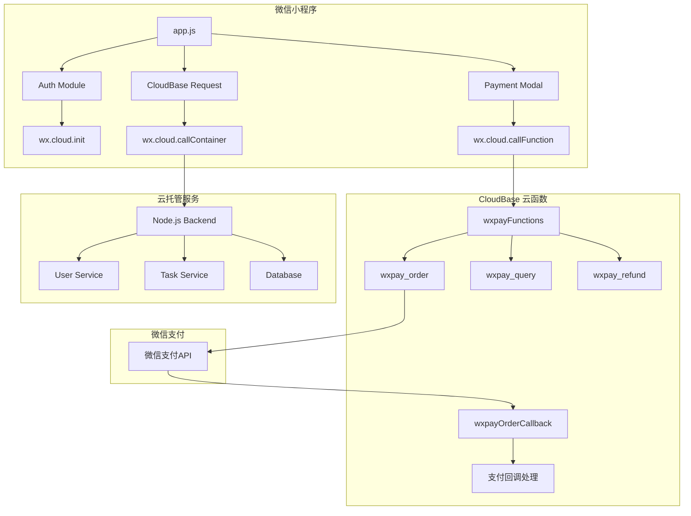
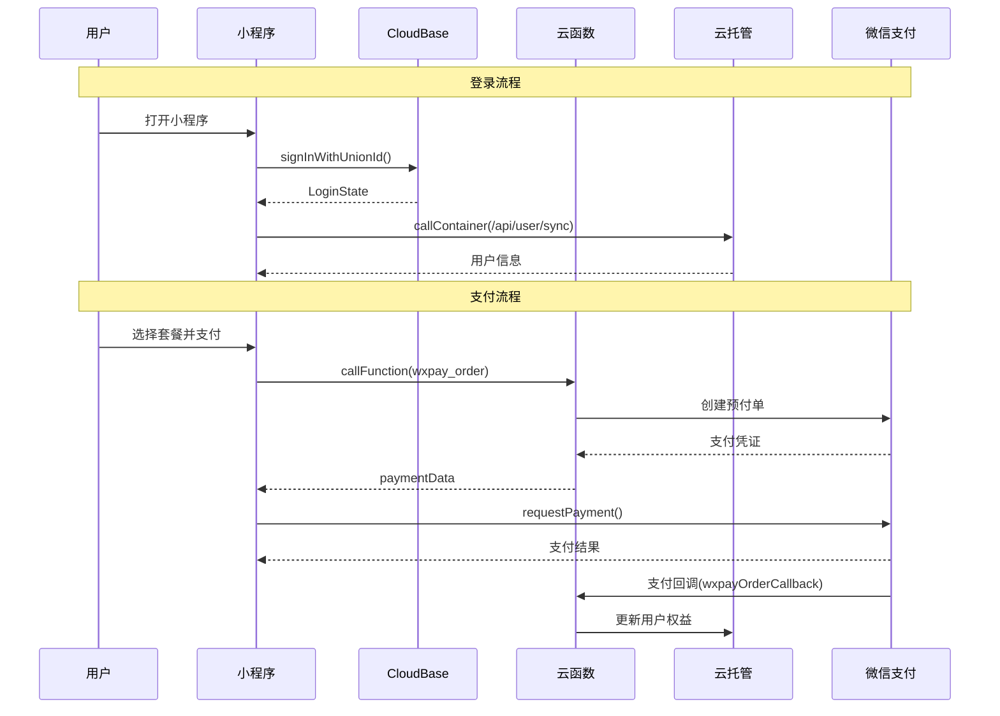

# Design Document

## Overview

本设计文档描述微信小程序 CloudBase 用户认证和支付系统的技术实现方案。系统采用分层架构，将认证、支付、后端调用等功能模块化，便于维护和扩展。

### 系统架构图



### 数据流图



## Architecture

### 模块划分

1. **认证模块 (miniprogram/utils/cloudbase-auth.js)**
   - CloudBase SDK 初始化
   - UnionId 静默登录
   - 登录状态管理
   - 退出登录

2. **支付模块 (miniprogram/utils/cloudbase-payment.js)**
   - 云函数调用封装
   - 支付流程管理
   - 订单状态查询

3. **云托管请求模块 (miniprogram/utils/cloudbase-request.js)**
   - callContainer 封装
   - 请求/响应拦截
   - 错误处理

4. **支付云函数 (miniprogram/cloudfunctions/wxpayFunctions/)**
   - wxpay_order: 下单
   - wxpay_query_order_by_out_trade_no: 订单查询
   - wxpay_refund: 退款

5. **支付回调云函数 (miniprogram/cloudfunctions/wxpayOrderCallback/)**
   - 接收微信支付通知
   - 更新订单状态
   - 同步用户权益

### 技术选型

| 功能 | 技术方案 |
|------|----------|
| 认证 | CloudBase UnionId 静默登录 |
| 后端调用 | wx.cloud.callContainer |
| 支付 | wx.cloud.callFunction + 云函数 |
| 数据存储 | CloudBase 数据库 + 云托管 PostgreSQL |
| 日志 | console + 错误上报服务 |

## Components and Interfaces

### 1. 认证模块接口

```javascript
// miniprogram/utils/cloudbase-auth.js

/**
 * 初始化 CloudBase
 * @param {Object} options - 配置选项
 * @param {string} options.env - 环境 ID
 * @returns {Promise<void>}
 */
async function initCloudBase(options)

/**
 * UnionId 静默登录
 * @returns {Promise<LoginState>}
 */
async function signInWithUnionId()

/**
 * 检查登录状态
 * @returns {Promise<boolean>}
 */
async function checkLoginState()

/**
 * 获取当前用户信息
 * @returns {Promise<UserInfo|null>}
 */
async function getCurrentUser()

/**
 * 退出登录
 * @returns {Promise<void>}
 */
async function signOut()

/**
 * 刷新登录状态
 * @returns {Promise<LoginState>}
 */
async function refreshLoginState()
```

### 2. 支付模块接口

```javascript
// miniprogram/utils/cloudbase-payment.js

/**
 * 创建支付订单
 * @param {Object} params - 订单参数
 * @param {string} params.packageType - 套餐类型 ('basic' | 'premium')
 * @param {string} params.generationId - 关联的生成任务ID
 * @param {string} params.userId - 用户ID
 * @returns {Promise<PaymentData>}
 */
async function createOrder(params)

/**
 * 发起微信支付
 * @param {PaymentData} paymentData - 支付凭证
 * @returns {Promise<PaymentResult>}
 */
async function requestPayment(paymentData)

/**
 * 查询订单状态
 * @param {string} outTradeNo - 商户订单号
 * @returns {Promise<OrderStatus>}
 */
async function queryOrder(outTradeNo)

/**
 * 申请退款
 * @param {Object} params - 退款参数
 * @param {string} params.transactionId - 微信交易号
 * @param {number} params.refundAmount - 退款金额(分)
 * @param {number} params.totalAmount - 原订单金额(分)
 * @returns {Promise<RefundResult>}
 */
async function refund(params)
```

### 3. 云托管请求接口

```javascript
// miniprogram/utils/cloudbase-request.js

/**
 * 调用云托管服务
 * @param {Object} options - 请求选项
 * @param {string} options.path - API 路径
 * @param {string} options.method - HTTP 方法
 * @param {Object} options.data - 请求数据
 * @param {Object} options.header - 额外请求头
 * @returns {Promise<any>}
 */
async function callContainer(options)

/**
 * GET 请求
 * @param {string} path - API 路径
 * @param {Object} params - 查询参数
 * @returns {Promise<any>}
 */
async function get(path, params)

/**
 * POST 请求
 * @param {string} path - API 路径
 * @param {Object} data - 请求体
 * @returns {Promise<any>}
 */
async function post(path, data)
```

### 4. 云函数接口

```javascript
// wxpayFunctions/wxpay_order/index.js

/**
 * 下单云函数入参
 * @typedef {Object} OrderParams
 * @property {string} packageType - 套餐类型
 * @property {string} generationId - 生成任务ID
 * @property {string} userId - 用户ID
 * @property {string} description - 商品描述
 */

/**
 * 下单云函数出参
 * @typedef {Object} PaymentData
 * @property {string} timeStamp - 时间戳
 * @property {string} nonceStr - 随机字符串
 * @property {string} packageVal - 预付单信息
 * @property {string} paySign - 签名
 * @property {string} outTradeNo - 商户订单号
 */
```

## Data Models

### 1. 用户模型 (CloudBase users 集合)

```javascript
{
  _id: string,           // CloudBase 用户 ID
  unionId: string,       // 微信 UnionId
  openId: string,        // 微信 OpenId
  backendUserId: string, // 云托管后端用户 ID
  paymentStatus: string, // 付费状态: 'free' | 'basic' | 'premium'
  createdAt: Date,
  updatedAt: Date
}
```

### 2. 订单模型 (CloudBase orders 集合)

```javascript
{
  _id: string,           // 订单 ID
  outTradeNo: string,    // 商户订单号
  transactionId: string, // 微信交易号
  userId: string,        // 用户 ID
  openId: string,        // 用户 OpenId
  packageType: string,   // 套餐类型: 'basic' | 'premium'
  amount: number,        // 订单金额(分)
  status: string,        // 订单状态: 'pending' | 'paid' | 'refunded' | 'failed'
  generationId: string,  // 关联的生成任务 ID
  paymentTime: Date,     // 支付时间
  refundTime: Date,      // 退款时间
  createdAt: Date,
  updatedAt: Date
}
```

### 3. 套餐配置

```javascript
const PACKAGES = {
  free: {
    id: 'free',
    name: '免费版',
    price: 0,
    amount: 0,  // 分
    features: ['标清图片', '可直接保存', '基础功能']
  },
  basic: {
    id: 'basic',
    name: '9.9元尝鲜包',
    price: 9.9,
    amount: 990,  // 分
    features: ['高清无水印', '3-5人合成', '热门模板']
  },
  premium: {
    id: 'premium',
    name: '29.9元尊享包',
    price: 29.9,
    amount: 2990,  // 分
    features: ['4K原图', '微动态', '贺卡', '全模板', '优先队列'],
    recommended: true
  }
};
```


## Correctness Properties

*A property is a characteristic or behavior that should hold true across all valid executions of a system-essentially, a formal statement about what the system should do. Properties serve as the bridge between human-readable specifications and machine-verifiable correctness guarantees.*

### Property 1: 登录状态存储 Round-Trip

*For any* 有效的登录状态对象（包含 userId、openId、token、过期时间），存储到本地后再读取，应该得到等价的登录状态对象。

**Validates: Requirements 2.2, 3.1**

### Property 2: 登录状态有效性检查

*For any* 登录状态（有效、过期、不存在），checkLoginState 方法应该返回正确的布尔值：
- 有效状态（未过期）返回 true
- 过期状态返回 false
- 不存在状态返回 false

**Validates: Requirements 3.2**

### Property 3: 退出登录状态清除

*For any* 已登录用户，执行退出登录后，本地存储应该不包含任何用户凭证，全局状态应该重置为初始值。

**Validates: Requirements 6.2, 6.3**

### Property 4: callContainer 请求头构造

*For any* callContainer 调用，请求头中必须包含 X-WX-SERVICE 字段，且值为配置的云托管服务名称。

**Validates: Requirements 4.2**

### Property 5: JSON 响应解析

*For any* 有效的 JSON 响应字符串，callContainer 解析后应该得到正确的 JavaScript 对象，且对象结构与原始 JSON 一致。

**Validates: Requirements 4.4**

### Property 6: 错误类型处理

*For any* 错误类型（网络错误、超时、服务器错误、业务错误），系统应该返回对应的错误处理策略（重试、提示、上报）。

**Validates: Requirements 4.5, 14.1**

### Property 7: 用户信息同步后本地更新

*For any* 成功的用户信息同步响应，本地存储的用户信息应该与响应数据一致。

**Validates: Requirements 5.3**

### Property 8: 云函数调用参数构造

*For any* 支付云函数调用，参数中必须包含 type 字段指定调用方法，且业务参数（packageType、generationId、userId）正确传递。

**Validates: Requirements 7.2, 9.1, 11.1**

### Property 9: 套餐金额映射

*For any* 套餐类型（basic、premium），对应的金额应该正确映射：
- basic: 990 分 (9.9元)
- premium: 2990 分 (29.9元)

**Validates: Requirements 7.4, 13.1**

### Property 10: 订单数据完整性

*For any* 创建的订单，必须包含所有必需字段（orderId、outTradeNo、userId、openId、packageType、amount、status、generationId、createdAt、updatedAt），且字段类型正确。

**Validates: Requirements 7.5, 12.2**

### Property 11: 订单状态机

*For any* 订单状态变更：
- 已支付订单：用户付费状态应该更新为对应套餐
- 未支付订单：用户付费状态应该保持不变
- 已退款订单：用户付费状态应该回退

**Validates: Requirements 9.2, 9.3, 9.5, 11.2**

### Property 12: 支付回调处理

*For any* 支付回调通知，当 event_type 为 TRANSACTION.SUCCESS 时，订单状态应该更新为 'paid'。

**Validates: Requirements 10.2**

### Property 13: 退款金额验证

*For any* 退款请求，退款金额必须小于等于原订单金额，且支持全额退款和部分退款。

**Validates: Requirements 11.4**

### Property 14: 商品描述格式

*For any* 订单，商品描述应该包含产品名称和套餐类型，格式为 "AI全家福-{套餐名称}"。

**Validates: Requirements 13.3**

## Error Handling

### 错误分类

| 错误类型 | 错误码范围 | 处理策略 |
|---------|-----------|---------|
| 网络错误 | NETWORK_* | 提示检查网络，提供重试 |
| 认证错误 | AUTH_* | 清除凭证，重新登录 |
| 支付错误 | PAY_* | 显示错误信息，提供重试 |
| 业务错误 | BIZ_* | 显示具体错误信息 |
| 系统错误 | SYS_* | 记录日志，上报错误 |

### 错误码定义

```javascript
const ERROR_CODES = {
  // 网络错误
  NETWORK_TIMEOUT: { code: 'NETWORK_TIMEOUT', message: '网络超时，请检查网络后重试' },
  NETWORK_OFFLINE: { code: 'NETWORK_OFFLINE', message: '网络不可用，请检查网络连接' },
  
  // 认证错误
  AUTH_EXPIRED: { code: 'AUTH_EXPIRED', message: '登录已过期，请重新登录' },
  AUTH_FAILED: { code: 'AUTH_FAILED', message: '登录失败，请重试' },
  AUTH_INVALID: { code: 'AUTH_INVALID', message: '登录状态无效' },
  
  // 支付错误
  PAY_CANCELLED: { code: 'PAY_CANCELLED', message: '支付已取消' },
  PAY_FAILED: { code: 'PAY_FAILED', message: '支付失败，请重试' },
  PAY_ORDER_FAILED: { code: 'PAY_ORDER_FAILED', message: '创建订单失败' },
  
  // 业务错误
  BIZ_USER_NOT_FOUND: { code: 'BIZ_USER_NOT_FOUND', message: '用户不存在' },
  BIZ_ORDER_NOT_FOUND: { code: 'BIZ_ORDER_NOT_FOUND', message: '订单不存在' },
  BIZ_INVALID_PACKAGE: { code: 'BIZ_INVALID_PACKAGE', message: '无效的套餐类型' },
  
  // 系统错误
  SYS_UNKNOWN: { code: 'SYS_UNKNOWN', message: '系统错误，请稍后重试' },
  SYS_CLOUD_ERROR: { code: 'SYS_CLOUD_ERROR', message: '云服务异常' }
};
```

### 重试策略

```javascript
const RETRY_CONFIG = {
  maxRetries: 3,
  retryDelay: 1000,  // 毫秒
  retryableErrors: ['NETWORK_TIMEOUT', 'SYS_CLOUD_ERROR'],
  exponentialBackoff: true
};
```

## Testing Strategy

### 测试框架

- **单元测试**: Jest (小程序环境模拟)
- **属性测试**: fast-check
- **集成测试**: 微信开发者工具 + 真机调试

### 测试覆盖

| 模块 | 单元测试 | 属性测试 | 集成测试 |
|------|---------|---------|---------|
| 认证模块 | ✓ | ✓ | ✓ |
| 支付模块 | ✓ | ✓ | ✓ |
| 云托管请求 | ✓ | ✓ | ✓ |
| 云函数 | ✓ | ✓ | ✓ |
| 错误处理 | ✓ | ✓ | - |

### 属性测试配置

```javascript
// 每个属性测试至少运行 100 次
const PBT_CONFIG = {
  numRuns: 100,
  seed: Date.now(),
  verbose: true
};
```

### 测试文件结构

```
miniprogram/
├── utils/
│   ├── __tests__/
│   │   ├── cloudbase-auth.test.js
│   │   ├── cloudbase-auth.property.test.js
│   │   ├── cloudbase-payment.test.js
│   │   ├── cloudbase-payment.property.test.js
│   │   ├── cloudbase-request.test.js
│   │   └── cloudbase-request.property.test.js
│   ├── cloudbase-auth.js
│   ├── cloudbase-payment.js
│   └── cloudbase-request.js
└── cloudfunctions/
    └── wxpayFunctions/
        └── __tests__/
            ├── wxpay_order.test.js
            └── wxpay_order.property.test.js
```

### 关键测试场景

1. **登录流程测试**
   - 首次登录成功
   - 登录状态恢复
   - 登录状态过期刷新
   - 登录失败处理

2. **支付流程测试**
   - 订单创建成功
   - 支付凭证获取
   - 支付成功回调
   - 支付取消处理
   - 支付失败重试

3. **错误处理测试**
   - 网络错误重试
   - 认证错误重新登录
   - 业务错误提示
