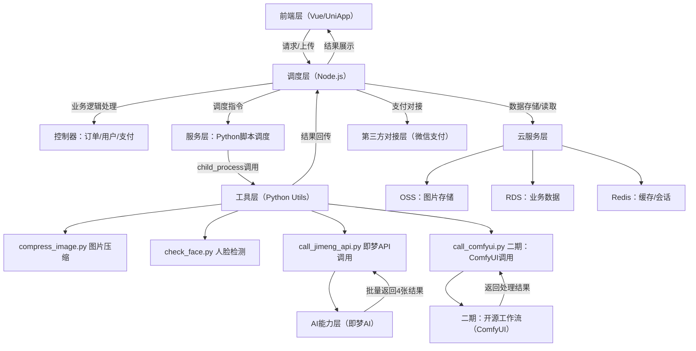
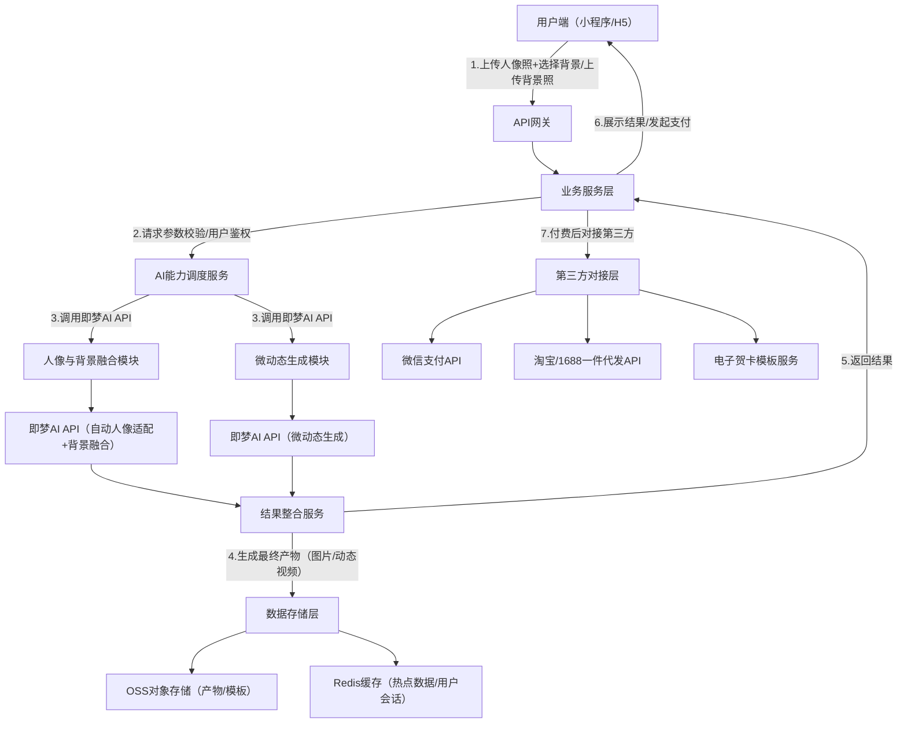

# AI全家福·团圆照相馆 完整技术方案

# 一、方案概述

## 1.1 核心目标

支撑产品1月20日（一期MVP）准时上线，采用“Node.js调度+Python Utils”架构，通过“即梦AI批量生成+4选1用户筛选”策略规避AI不确定性，实现“时空拼图”“富贵变身”“微动态生成”三大核心功能；二期逐步引入开源工作流降低成本，保障全程用户体验流畅、商业化闭环顺畅，兼顾快速迭代与图像处理需求。

## 1.2 技术核心原则

- 架构协同：Node.js负责高并发业务调度，Python专注图像处理与AI对接，发挥各自优势；

- 容错优先：以“4选1”产品策略弥补AI生成不确定性，降低“脸崩”退款风险；

- 快速落地：一期依赖即梦AI快速跑通闭环，二期迭代优化成本与功能；

- 轻量化部署：云服务+容器化架构，支持弹性扩容，控制运维成本；

- 隐私安全：用户数据全程加密，原始图片合成后24小时自动清理。

## 1.3 技术栈总览

|技术层级|核心技术/工具|选型说明|
|---|---|---|
|前端层|Vue/UniApp（小程序/H5）|覆盖下沉市场，支持4宫格结果展示，操作便捷|
|调度层（核心）|Node.js（Express/NestJS）|高并发处理，全栈开发效率高，负责业务逻辑与Python调度|
|工具层|Python Utils（Pillow/OpenCV/requests）|图像处理领域优势明显，封装AI接口与独立处理脚本|
|AI能力层|一期：即梦AI API；二期：ComfyUI+开源模型|一期借大厂API快速落地，二期自建工作流降本|
|云服务层|阿里云ECS/OSS/CDN/RDS、Redis|稳定可靠，支持弹性扩容，适配节日流量高峰|
|第三方对接层|微信支付、淘宝/1688一件代发API|快速实现商业化闭环，无需自建物流库存|
## 1.1 核心目标

支撑产品1月20日准时上线，通过“现成API组合+轻量化开发”模式，实现“时空拼图”“富贵变身”“微动态生成”三大核心功能，保障多人合成人脸自然度、背景融合协调性，同时控制算力成本与技术风险，确保用户体验流畅、商业化闭环顺畅。

## 1.2 技术核心原则

- 拒绝自研：全链路采用成熟API/开源模型调用，规避多人视频生成、人脸修复等技术陷阱；

- 稳定性优先：核心API均配备备选方案，关键环节增加校验机制，降低“脸崩”“合成失败”概率；

- 轻量化部署：基于云服务+容器化架构，快速扩容且控制运维成本；

- 隐私安全：用户上传图片全程加密处理，仅用于合成服务，合成后自动清理原始数据。

## 1.3 技术栈总览

|技术层级|核心技术/工具|选型说明|
|---|---|---|
|前端层|微信小程序（主端）、H5（备用）|覆盖下沉市场用户，无需下载，操作便捷|
|后端层|Node.js（Express框架）、Redis（缓存）|轻量化开发，高并发处理能力适配节日峰值|
|AI能力层|即梦AI API（覆盖人像融合、背景替换、微动态生成全流程）|成熟技术组合，保障合成效果与效率|
|云服务层|阿里云ECS、OSS（存储）、CDN（分发）|稳定可靠，支持弹性扩容，适配节日流量高峰|
|第三方对接层|微信支付、淘宝/1688一件代发API|快速实现商业化闭环，无需自建物流库存|
# 二、核心架构设计：Node.js 调度 + Python Utils

结合Node.js高并发/全栈开发优势与Python在图像处理领域的统治力，实现“业务调度与工具处理”解耦，适配快速迭代与AI对接需求。

## 2.1 系统拓扑图


## 2.2 目录结构示意

```text

/project-root
  ├── /server (Node.js 调度核心)
  │     ├── /controllers (业务逻辑：订单/用户/支付)
  │     ├── /services (调度服务：Python脚本调用)
  │     ├── /middleware (鉴权/日志)
  │     └── index.js (服务入口)
  ├── /python_utils (Python 工具箱)
  │     ├── requirements.txt (依赖包)
  │     ├── compress_image.py  # 预处理：压缩与格式转换
  │     ├── check_face.py      # 预处理：人脸检测(OpenCV)
  │     ├── call_jimeng_api.py # 核心：即梦API封装
  │     └── call_comfyui.py    # 二期：ComfyUI工作流调用
  ├── /frontend (Vue/UniApp)   # 前端：上传/4宫格展示/支付
  └── /temp (临时文件)         # 数据交换临时目录

```

## 2.3 核心通信方式

Node.js 通过 `child_process` 的 spawn/exec 方法调用Python脚本，通过`stdin/stdout` 传递JSON格式参数与结果，或通过临时文件（/temp）交换图片数据，确保通信高效且解耦。

## 2.4 代码实现Demo

### 2.4.1 Python工具脚本（call_jimeng_api.py）

```python

import sys
import json
import requests
from PIL import Image

# 即梦API封装
def call_jimeng(image_path, style):
    # 即梦API配置
    JIMENG_API_KEY = "your_api_key"
    JIMENG_API_URL = "https://api.jimengai.com/image/fusion"
    
    # 读取图片
    with open(image_path, 'rb') as f:
        image_data = f.read()
    
    # 批量生成4张（利用seed随机性）
    results = []
    for seed in [1001, 1002, 1003, 1004]:
        params = {
            "style": style,
            "seed": seed,
            "prompt": "Best quality, family reunion, high definition, realistic lighting",
            "person_adapt": True,
            "light_unify": "auto"
        }
        headers = {"Authorization": f"Bearer {JIMENG_API_KEY}"}
        files = {"image": image_data}
        
        response = requests.post(JIMENG_API_URL, data=params, headers=headers, files=files)
        if response.status_code == 200:
            result_url = response.json()["result_url"]
            results.append(result_url)
    
    # 返回4张结果
    return {
        "status": "success",
        "original_path": image_path,
        "style": style,
        "generated_images": results  # 4张图片URL列表
    }

if __name__ == "__main__":
    # 接收Node.js传递的参数（图片路径、风格）
    input_data = json.loads(sys.argv[1])
    image_path = input_data["image_path"]
    style = input_data["style"]
    
    # 调用即梦API
    output = call_jimeng(image_path, style)
    
    # 输出JSON结果供Node.js解析
    print(json.dumps(output))

```

### 2.4.2 Node.js调度服务（imageService.js）

```javascript

const { spawn } = require('child_process');
const path = require('path');
const fs = require('fs');

// 生成全家福服务：调度Python脚本调用即梦API
exports.generateFamilyPhoto = (imagePath, style) => {
    return new Promise((resolve, reject) => {
        const pythonScript = path.join(__dirname, '../../python_utils/call_jimeng_api.py');
        const inputData = JSON.stringify({ imagePath, style });
        
        // 调用Python脚本（传递JSON参数）
        const pythonProcess = spawn('python3', [pythonScript, inputData]);
        
        let dataString = '';
        // 接收Python输出
        pythonProcess.stdout.on('data', (data) => {
            dataString += data.toString();
        });
        
        // 错误处理
        pythonProcess.stderr.on('data', (data) => {
            console.error(`Python脚本错误：${data}`);
        });
        
        // 进程结束后解析结果
        pythonProcess.on('close', (code) => {
            if (code !== 0) {
                return reject(`Python进程退出码：${code}`);
            }
            try {
                const result = JSON.parse(dataString);
                if (result.status === "success" && result.generated_images.length === 4) {
                    resolve(result);
                } else {
                    reject("即梦API调用失败，未返回4张结果");
                }
            } catch (e) {
                reject(`结果解析失败：${e.message}`);
            }
        });
    });
};

```

## 2.1 架构总览（分层架构）

采用“前端交互层-网关层-业务服务层-AI能力层-数据存储层-第三方对接层”六级架构，各层解耦，便于快速开发、测试与迭代。

## 2.2 核心架构流程图


# 三、分阶段实施规划

## 3.1 一期方案（MVP，1月20日上线）：即梦AI + 4选1策略

核心目标：快速跑通闭环，依赖即梦AI强力接口，通过“批量生成4张+用户筛选”规避AI不确定性，保障交付满意度。

### 3.1.1 核心业务流程（4选1策略）

1. 上传：用户上传全家福/单人照（1-5人），选择风格（新中式/欧式等）；

2. 前端预处理：提示用户上传清晰正面照，限制图片大小≤10MB；

3. 调度处理：Node.js接收图片保存至OSS临时目录，调用Python脚本；

4. 批量生成：Python脚本调用即梦API，通过不同seed值一次性生成4张细微差异的结果图；

5. 用户筛选：前端以4宫格展示结果，用户选择1张最满意的图片；

6. 后续处理：用户可对选中图片进行微动态生成（调用即梦微动态接口）；

7. 商业化闭环：免费版仅可生成1张图（带水印），付费版（9.9元起）解锁4选1+无水印+微动态。

### 3.1.2 关键技术点与对策

- 问题1：API调用成本增加（4倍调用量）
对策：仅付费版开启4选1，免费版生成1张带水印图，控制成本；

- 问题2：4张结果质量不稳定
对策：预埋高质量Prompt（如“Best quality, family reunion, realistic lighting”），提前测试调优，确保4张中至少2张完美；

- 问题3：Node.js并发调用Python脚本资源泄露
对策：通过进程池管理Python进程，设置超时时间（30秒），确保进程正常回收。

### 3.1.3 优点与风险

- 优点：开发快（仅需调通1个核心API）、容错性高（用户筛选规避脸崩）、用户参与感强；

- 风险：API调用成本高、依赖即梦AI稳定性；

- 应对：提前与即梦沟通节日算力扩容，付费定价覆盖API成本。

## 3.2 二期方案：混合架构降本增效

核心目标：引入开源工作流，降低API依赖与成本，拓展个性化功能（指定换装等）。

### 3.2.1 混合调度逻辑

Node.js根据用户套餐与需求，路由至不同Python工具脚本：

- 场景A（普通换背景）：继续调用即梦API（效果稳定）；

- 场景B（指定换装/高保真）：调用call_comfyui.py，对接部署在Replicate/本地GPU的ComfyUI工作流，实现“Mask抠图→ControlNet固定姿态→IP-Adapter保人脸→生成”全流程；

- 场景C（老照片修复）：调用fix_face.py，对接阿里/腾讯人脸增强API（低成本高真实）。

### 3.2.2 架构升级要点

- Python Utils新增脚本：process_mask.py（遮罩处理）、merge_video.py（OpenCV简单特效叠加）；

- 新增GPU服务器：部署ComfyUI，适配开源模型运行；

- 成本优化：开源工作流调用成本较即梦API降低60%以上，高客单用户优先路由至开源流程。

# 四、核心功能模块技术实现（基于一期方案）

## 4.1 核心功能一：时空拼图（4选1模式）

### 4.1.1 技术流程

1. 用户上传多人人像照+选择背景风格；

2. Node.js调用compress_image.py，将图片压缩至2MB内、统一为PNG格式；

3. 调用check_face.py，通过OpenCV简单检测人脸清晰度，不合格则提示用户重传；

4. 调用call_jimeng_api.py，批量生成4张融合后的全家福；

5. 前端展示4宫格结果，用户选择后，调用即梦微动态接口生成动态效果；

6. 结果保存至OSS，返回用户下载/分享。

## 4.2 核心功能二：富贵变身（背景替换+可选换装）

### 4.2.1 技术流程

1. 用户上传现有全家福+选择目标背景/服饰风格；

2. 一期：调用即梦背景替换接口，批量生成4张结果供选择；

3. 二期：指定换装需求时，路由至ComfyUI工作流，生成贴合人体的服饰效果。

## 4.3 核心功能三：微动态生成

基于用户选中的静态图，调用即梦微动态接口，生成5秒短视频/Live Photo，仅背景动态（烟花/灯笼），人物轻微微动，规避恐怖谷效应。

# 五、API选型与集成方案

## 5.1 一期核心API选型表

|功能模块|API/工具|调用方式|关键参数|
|---|---|---|---|
|人像与背景融合|即梦AI融合接口|Python脚本封装调用|seed=多值（1001-1004），prompt=高质量描述，light_unify=auto|
|微动态生成|即梦AI微动态接口|Python脚本封装调用|motion_bucket_id=10，dynamic_type=festival|
|人脸检测（预处理）|Python OpenCV|本地脚本调用|最小人脸尺寸=80x80，置信度阈值=0.7|
|支付对接|微信支付API|Node.js直接调用|统一下单接口，回调通知验证|
## 5.2 集成关键策略

- 容错机制：Python脚本调用API设置30秒超时，失败重试1次；4张结果不足时，补充调用1次即梦API；

- 成本控制：免费用户每日1次调用限额，付费用户按套餐区分API调用权限（尊享包可调用增强版接口）；

- 缓存策略：常用背景风格的Prompt、模板图片缓存至Redis，减少重复处理。

## 3.1 核心功能一：时空拼图（解决人聚不齐）

### 3.1.1 技术流程

1. 用户上传多人人像照片（支持1-5人，格式为JPG/PNG，分辨率≥720P）+ 选择预设背景模板（红木沙发/故宫等）或上传自定义背景图；

2. 前端预处理：压缩图片（保持清晰度前提下降低体积）、获取图片元信息（光线、分辨率）；

3. 后端调用即梦AI API：将所有人人像照片与选定背景图传入即梦最新模型，由模型自动完成人像适配、光线统一、美颜优化及自然融合；

4. 最终校验：AI检测合成图人脸是否扭曲、边缘是否自然，通过则返回结果，失败则重新调整参数调用即梦AI API优化。

### 3.1.2 关键技术点与解决方案

- 问题1：多人脸朝向不同，融合后姿态不自然
解决方案：通过即梦AI API参数指定人像适配规则，利用模型自带的姿态校准能力，自动调整人像角度、大小与背景场景透视匹配；

- 问题2：不同照片光线差异大，融合后突兀
解决方案：调用即梦AI API的光线统一功能，无需额外提取背景参数，模型自动识别并对齐人像与背景的色温、亮度；

## 3.2 核心功能二：富贵变身（解决背景太土）

### 3.2.1 技术流程

1. 用户上传现有全家福照片 + 选择目标风格背景（新中式国潮/欧式豪宅等）；

2. 前端预处理：压缩图片、校验格式；

3. 背景替换与融合：调用即梦AI API，将上传的全家福人像与目标背景传入模型，模型自动完成人像提取、背景替换及光影融合；

4. 衣物风格替换（可选）：用户选择“唐装/旗袍”变身，通过即梦AI API的服饰替换接口，基于人物姿态生成贴合的服饰效果；

5. 最终校验：检测合成效果，通过则返回高清无水印图片，失败则重新调用即梦AI API优化。

### 3.2.2 关键技术点与解决方案

- 问题1：原始照片人物密集，分割不准确
解决方案：依赖即梦AI模型的高精度人像提取能力，无需额外多目标分割标记，模型自动精准识别并提取多人像区域；

- 问题2：换衣后衣物与人体贴合度差
解决方案：通过即梦AI API的服饰替换专用参数，关联人物姿态关键点，确保生成衣物的褶皱、版型与人体自然贴合。

## 3.3 核心功能三：微动态生成（Live Photo/5秒短视频）

### 3.3.1 技术流程

1. 基于合成后的静态全家福图片，用户选择微动态风格（烟花/灯笼/雪花）；

2. 动态效果生成：调用即梦AI API的微动态生成接口，对合成后的静态全家福图片添加动态效果（烟花/灯笼/雪花），人物区域设置high retention（高保真）参数，确保人物仅轻微微笑微动；

3. 格式转换：生成5秒短视频（MP4格式），同时导出Live Photo格式（适配苹果用户）；

4. 效果优化：对动态视频进行防抖、降噪处理，确保画面流畅无卡顿。

### 3.3.2 关键技术点与解决方案

- 问题1：动态生成后人物面部模糊/扭曲
解决方案：限制人物动态幅度（仅眼部/嘴角轻微微动），通过即梦AI API的低动态参数配置，提升人物保真度；

- 问题2：动态效果与背景不协调
解决方案：预设动态效果与背景模板的匹配规则，调用即梦AI API时传入场景匹配参数，确保动态效果与背景风格统一。

# 四、API选型与集成方案

## 4.1 核心AI API选型表

|功能模块|主选API/模型|备选API/模型|选型理由|调用参数配置|
|---|---|---|---|---|
|人像与背景融合|即梦AI API（融合接口）|即梦AI API（增强版接口）|无需单独抠图，一键完成人像与背景融合，光线统一效果好，适配多人场景，开发效率高|mode=fusion（融合模式），person_adapt=true（人像自适应），light_unify=auto（自动光线统一）|
|人脸修复/美颜|即梦AI API（美颜修复接口）|无（即梦API已覆盖核心能力）|集成修复与美颜功能，效果自然，可与融合接口联动调用，减少API调用次数|fidelity=0.7（保真度），beauty_level=3（轻度美颜），repair=true（修复开启）|
|背景替换|即梦AI API（背景替换接口）|无（即梦API已覆盖核心能力）|自动精准提取人像区域，支持多种风格背景替换，边缘融合自然|bg_type=custom（自定义背景），edge_blur=1.5（边缘模糊优化），resolution=4K|
|微动态生成|即梦AI API（微动态接口）|无（即梦API已覆盖核心能力）|基于静态图生成动态效果，人物保真度高，动态过渡流畅，适配节日场景动态元素|motion_bucket_id=10（低动态），fps=10，video_length=5s，dynamic_type=festival（节日动态）|
|衣物风格替换|即梦AI API（服饰替换接口）|无（即梦API已覆盖核心能力）|基于人物姿态生成贴合服饰，风格多样，可与融合接口联动，提升操作效率|cloth_style=tang（唐装）/cheongsam（旗袍），fit=true（贴合优化）|
## 4.2 API集成关键策略

- API调用优先级：全功能依赖即梦AI API，根据功能需求调用对应接口，高端套餐（29.9元尊享包）可调用即梦AI增强版接口提升效果；

- 容错机制：每个即梦AI API调用设置超时时间（30秒），超时则重试调用（最多2次）；调用失败后记录日志，同步反馈即梦技术支持优化参数；

- 成本控制：对免费版用户调用即梦AI API进行频率限制（每日1次），且使用基础版接口；付费用户无限制，尊享包用户调用增强版接口；批量调用时开启缓存，重复背景模板可复用生成结果。

# 六、部署与运维方案

## 6.1 部署架构（一期）

- Web服务集群：2台阿里云ECS（4核8G）部署Node.js服务，开启负载均衡，应对节日高峰；

- 工具层：1台ECS（8核16G）部署Python环境，运行工具脚本，通过进程池管理调用；

- 数据存储：OSS存储图片（原始/生成结果），RDS存储业务数据，Redis缓存热点数据与会话；

- 监控告警：阿里云云监控+自定义日志，监控指标：Node.js进程存活、Python脚本调用成功率（≥99%）、API调用失败率（≤1%）、CPU使用率（≥80%告警）。

## 6.2 运维保障策略

- 灰度发布：1月15日开启，邀请1000名种子用户测试4选1流程与支付闭环；

- 扩容预案：节日期间（1月20日-2月10日）开启ECS弹性扩容，Redis缓存扩容；

- 故障应急：制定API调用失败、服务器宕机、支付异常预案，24小时运维值班，响应时间≤30分钟；

- 数据清理：用户原始图片合成后24小时自动删除，生成结果保留30天（用户可手动下载备份）。

# 七、测试方案

## 7.1 测试范围与重点

|测试类型|测试重点|测试方法|
|---|---|---|
|功能测试|4选1流程完整性、API批量调用稳定性、支付与鉴权逻辑|人工测试（不同图片/风格）、自动化脚本覆盖核心流程|
|性能测试|并发100人时Node.js/Python响应速度、API调用延迟|压力测试工具模拟并发，监控资源占用|
|兼容性测试|不同机型/微信版本的4宫格展示、图片上传兼容性|真机测试（覆盖主流安卓/苹果机型）|
|容错测试|模糊图片上传、API调用失败、网络中断后的恢复逻辑|异常场景模拟，验证用户提示与流程回退机制|
## 7.2 验收标准

- 功能验收：4选1流程顺畅，生成结果无脸崩，微动态效果流畅，付费后正常解锁功能；

- 性能验收：单用户合成响应时间≤15秒，并发100人成功率≥99%，CDN加载速度≤2秒；

- 体验验收：用户操作步骤≤5步，种子用户对4选1满意度≥90%；

- 安全验收：数据传输/存储加密，无隐私泄露，支付逻辑无漏洞。

# 八、极速上线执行表（1月20日DDL）

|时间段|重点任务|涉及技术栈|责任人|交付物|
|---|---|---|---|---|
|Day 1-2|API跑通：Python脚本封装即梦API，手动生成4张全家福|Python、即梦API|后端/AI工程师|可运行的call_jimeng.py脚本，4张生成结果|
|Day 3-5|框架搭建：Node.js服务端+前端上传/4宫格展示页|Node.js、Vue|全栈工程师|Node.js基础框架、前端页面原型|
|Day 6-8|闭环调试：上传→Node→Python→API→返回→前端展示|Node.js、Python、前端|全栈工程师|可顺畅运行的核心业务闭环|
|Day 9-10|支付与鉴权：接入微信支付，限制免费次数|Node.js、微信支付API|后端工程师|完整支付闭环，免费次数限制功能|
|Day 11-12|Prompt调优：测试不同Prompt，确保4张中至少2张完美|Prompt Engineering|产品/运营|优化后的Prompt列表|
|Day 13-14|压力测试&上线：确保并发100人稳定，监控开启|运维、云服务|全栈工程师|压力测试报告，产品正式上线|
# 九、风险与应对措施

|风险类型|风险描述|应对措施|
|---|---|---|
|技术风险|即梦API调用失败/4张结果质量差|1. 提前与即梦沟通节日算力扩容；2. 预埋优质Prompt库；3. 建立人工审核通道，失败订单手动优化重生成|
|成本风险|4倍API调用量导致成本超支|1. 付费定价覆盖API成本（9.9元档毛利率≥60%）；2. 限制免费用户调用频率；3. 二期切换开源工作流降本|
|流量风险|节日期间并发突增，服务器过载|1. 开启ECS弹性扩容；2. 对免费用户进行流量限制；3. 优化Redis缓存，减少数据库压力|
|商业风险|一件代发商家发货延迟，影响满意度|1. 对接3-5家备选商家；2. 提前告知用户发货周期；3. 建立售后维权通道|
|合规风险|用户隐私泄露/图片版权问题|1. 严格执行原始图片24小时删除机制；2. 模板图片购买商用版权；3. 签署用户隐私协议|
# 十、成本预估（月度，一期）

|成本项|预估金额（元）|说明|
|---|---|---|
|云服务成本|9000-11000|3台ECS、OSS、CDN、RDS、Redis（含弹性扩容预留）|
|API调用成本|8000-12000|按日均1000次付费调用（4张/次），即梦API单价0.02元/次预估|
|模板版权成本|1000-2000|商用背景模板、字体版权|
|运维与人工成本|15000-20000|开发、测试、运维人员薪酬（项目制估算）|
|其他成本（售后/应急）|2000-3000|售后客服、应急故障处理|
|总计|35000-48000|节日期间流量高峰可能增加10%-20%成本|
# 十一、方案亮点总结

- 容错性极致：“4选1”策略将AI不确定性转化为用户挑选乐趣，大幅降低脸崩退款风险；

- 开发效率高：Node.js与Python各司其职，解耦架构减少适配成本，快速跑通闭环；

- 进退自如：一期借大厂API快速变现，二期引入开源工作流降本，平衡速度与成本；

- 成本可控：通过付费分层、免费限流控制API成本，确保商业化可行性。

Next Step：优先推进call_jimeng.py脚本开发与即梦API调通，手动验证单张全家福生成效果，这是项目可行性验证的核心第一步。

## 5.1 数据存储架构

- 用户上传原始图片：存储在阿里云OSS，开启私有访问权限，仅后端服务可访问；合成完成后24小时自动删除原始图片，仅保留合成产物；

- 合成产物（图片/视频）：OSS分类存储（按用户ID/功能类型），开启CDN加速，确保不同地区用户快速加载；

- 热点数据（模板/用户会话）：Redis缓存，减少数据库查询压力；模板图片提前预加载，提升用户选择体验；

- 业务数据（订单/支付信息）：存储在阿里云RDS数据库，开启数据备份（每日增量备份，每周全量备份）。

## 5.2 隐私安全保障

- 数据传输加密：前端与后端之间采用HTTPS协议，API调用采用Token鉴权，防止数据被窃取；

- 用户授权机制：明确告知用户图片使用范围（仅用于合成服务），获取用户授权后再进行处理；

- 合规性保障：符合《个人信息保护法》，不收集无关用户信息，合成产物仅归用户所有，不用于其他商业用途；

- 安全审计：记录所有数据访问日志，定期排查异常访问，防止数据泄露。

# 六、部署与运维方案

## 6.1 部署架构

采用“云服务器+容器化”部署模式，基于阿里云ECS搭建集群，具体架构如下：

- Web服务集群：2台ECS实例（4核8G）部署前端小程序后端服务，开启负载均衡，应对节日流量高峰；

- AI调度服务：1台ECS实例（8核16G）部署AI API调度逻辑，确保调用效率；

- 数据库与缓存：阿里云RDS（MySQL）+ Redis集群，确保数据稳定；

- 监控告警：部署阿里云云监控，对服务器负载、API调用成功率、用户访问量进行实时监控，设置阈值告警（如CPU使用率≥80%、API失败率≥5%）。

## 6.2 运维保障策略

- 灰度发布：1月15日开启灰度发布，邀请1000名种子用户测试，收集反馈优化后，1月20日全量上线；

- 扩容预案：节日期间（1月20日-2月10日）开启弹性扩容，根据流量峰值自动增加ECS实例数量；

- 故障应急：制定API故障、服务器宕机、支付异常等应急预案，安排24小时运维值班，故障响应时间≤30分钟；

- 版本迭代：上线后根据用户反馈，每周迭代1次小版本，优化合成效果与用户体验。

# 七、测试方案

## 7.1 测试范围与重点

|测试类型|测试重点|测试方法|
|---|---|---|
|功能测试|三大核心功能实现效果、参数配置有效性、API切换逻辑|人工测试（上传不同类型照片）、自动化脚本测试（API调用流程）|
|性能测试|合成响应时间、并发处理能力、CDN加载速度|压力测试（模拟1000人同时上传）、负载测试（持续24小时高并发）|
|兼容性测试|不同手机型号（安卓/苹果）、不同微信版本、弱网环境适配|真机测试（覆盖主流机型）、弱网模拟测试（2G/3G环境）|
|用户体验测试|操作流程便捷性、合成效果自然度、付费流程顺畅性|种子用户测试、问卷调查、用户行为分析|
|安全测试|数据加密有效性、权限控制、防SQL注入/恶意攻击|渗透测试、安全扫描工具检测|
## 7.2 验收标准

- 功能验收：合成图人脸无扭曲、边缘自然，动态效果流畅，付费后产物正常下载；

- 性能验收：单张合成响应时间≤10秒，并发1000人时成功率≥99%，CDN加载速度≤2秒；

- 体验验收：用户操作步骤≤5步，种子用户满意度≥90%；

- 安全验收：数据传输/存储加密通过，无隐私泄露风险。

# 八、上线计划与时间节点

|时间节点|核心任务|责任人|交付物|
|---|---|---|---|
|1月5日-1月8日|前端开发（小程序界面/交互）、后端服务搭建|前端/后端开发工程师|可运行的前端原型、后端基础框架|
|1月9日-1月12日|AI API集成、核心功能开发|全栈开发工程师/AI工程师|三大核心功能可正常调用，合成效果达标|
|1月13日-1月14日|第三方对接（微信支付/一件代发）、数据存储部署|后端开发工程师/运维工程师|商业化闭环打通，数据存储安全可用|
|1月15日-1月19日|灰度测试、问题修复、性能优化|测试工程师/开发工程师|测试报告、优化后的版本|
|1月20日|全量上线、运维监控开启|运维工程师/项目负责人|产品正式上线，监控体系正常运行|
# 九、风险与应对措施

|风险类型|风险描述|应对措施|
|---|---|---|
|技术风险|核心API调用失败/合成效果差，影响用户体验|1. 依赖即梦AI API的稳定性保障，提前与即梦沟通节日期间算力扩容；2. 提前储备高质量模板，降低API调用复杂度；3. 建立人工审核通道，对合成失败订单手动调整参数重新调用即梦AI API优化|
|流量风险|节日期间用户量暴增，服务器过载|1. 开启弹性扩容；2. 对免费用户进行流量限制；3. 提前预热服务器，优化缓存策略|
|商业风险|一件代发商家发货延迟，影响用户满意度|1. 对接3-5家备选商家；2. 提前告知用户发货周期；3. 建立售后维权通道，及时处理投诉|
|合规风险|用户隐私泄露/图片版权问题|1. 严格执行数据加密与删除机制；2. 模板图片确保版权合规（购买商用版权/自制）；3. 签署用户隐私协议|
# 十、成本预估（月度）

|成本项|预估金额（元）|说明|
|---|---|---|
|云服务成本|8000-10000|ECS实例、OSS存储、CDN、RDS、Redis|
|API调用成本|5000-8000|按用户量预估，付费API按调用次数计费|
|模板版权成本|1000-2000|购买商用背景模板、字体版权|
|运维与人工成本|15000-20000|开发、测试、运维人员薪酬（按兼职/项目制估算）|
|其他成本（售后/应急）|2000-3000|售后客服、应急故障处理|
|总计|31000-43000|节日期间流量高峰可能增加10%-20%成本|